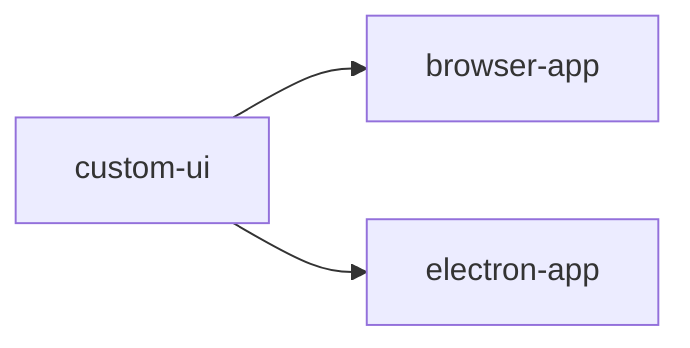

# Architecture

PlainScript is a **Turbo monorepo** composed of three npm workspaces layered on top of Eclipse
Theia.

---

## Repository Layout

```
PlainScript/
├── custom-ui/          # Custom Theia frontend plugin (TypeScript)
│   └── src/frontend/   # All UI customisation source files
├── browser-app/        # Theia browser application entry point
├── electron-app/       # Theia Electron application entry point
├── plugins/            # Pre-bundled VS Code–compatible extensions
├── scripts/            # Build and launch helper scripts
├── docs/               # MkDocs documentation source (this site)
├── .github/workflows/  # CI/CD and docs deployment workflows
├── mkdocs.yml          # MkDocs configuration
├── turbo.json          # Turbo pipeline configuration
└── package.json        # Root monorepo config
```

---

## Build Graph

Turbo builds workspaces in topological order:



`custom-ui` is compiled first as a Theia frontend plugin; both application targets depend on it.

---

## Theia Customisation Model

PlainScript customises Theia by providing a **ContainerModule** (`custom-ui/src/frontend/index.ts`)
that is registered as a Theia frontend plugin. The module uses InversifyJS `bind` / `rebind` to
replace or augment Theia's built-in services and widgets.

### What is Customised

| Feature                                   | Mechanism                                                   | Source file                                                                    |
| ----------------------------------------- | ----------------------------------------------------------- | ------------------------------------------------------------------------------ |
| Application shell layout                  | `rebind(ApplicationShell)`                                  | [`application-shell.ts`](api/application-shell.md)                             |
| Side-panel tab bar position               | `rebind(SidePanelHandler)`                                  | [`application-shell.ts`](api/application-shell.md)                             |
| Default view layout on startup            | `FrontendApplicationContribution`                           | [`application-shell.ts`](api/application-shell.md)                             |
| Command/menu pruning & additions          | `CommandContribution`, `MenuContribution`                   | [`commands-contributions.ts`](api/commands-contributions.md)                   |
| Contribution filtering (hide panels)      | `FilterContribution`                                        | [`contribution-filters.ts`](api/contribution-filters.md)                       |
| Keyboard shortcut reference command       | `CommandContribution`, `MenuContribution`                   | [`keyboard-shortcuts-contribution.ts`](api/keyboard-shortcuts-contribution.md) |
| File navigator (no Open Editors)          | `rebind(NavigatorWidgetFactory)`                            | [`navigator-widget-factory.ts`](api/navigator-widget-factory.md)               |
| Output panel (locked, no toolbar buttons) | `rebind(OutputToolbarContribution)`, `rebind(OutputWidget)` | [`output-toolbar-contribution.ts`](api/output-toolbar-contribution.md)         |

### What is Filtered Out

The following Theia contributions are blocked from registering via `RemoveFromUIFilterContribution`:

- `DebugFrontendApplicationContribution`
- `DebugFrontendContribution`
- `ScmContribution`
- `OutlineViewContribution`
- `CallHierarchyContribution`
- `ProblemContribution`
- `PluginApiFrontendContribution`
- `PluginFrontendViewContribution`
- `WindowContribution`
- All `@theia/test` view contributions

---

## Dependency Injection

PlainScript uses the [InversifyJS](https://inversify.io/) container that Theia provides. All custom
classes are decorated with `@injectable()` and registered through the ContainerModule entry point.
Constructor-injected dependencies use `@inject()` with Theia's service identifiers.

---

## CI/CD Pipelines

| Workflow             | Trigger                        | Purpose                                             |
| -------------------- | ------------------------------ | --------------------------------------------------- |
| `ci.yml`             | Push / PR to `main`, `develop` | Lint + build (required status checks)               |
| `build-appimage.yml` | Push of `v*` tag               | Build Linux AppImage, macOS DMG, Windows NSIS       |
| `docs.yml`           | Push to `main`                 | Build and deploy this documentation to GitHub Pages |
